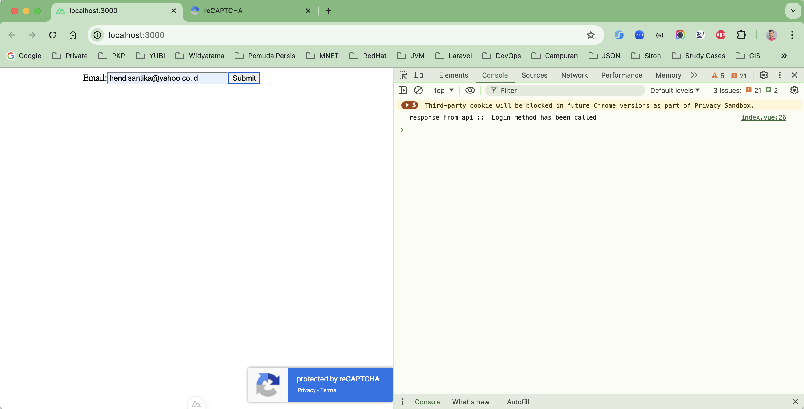
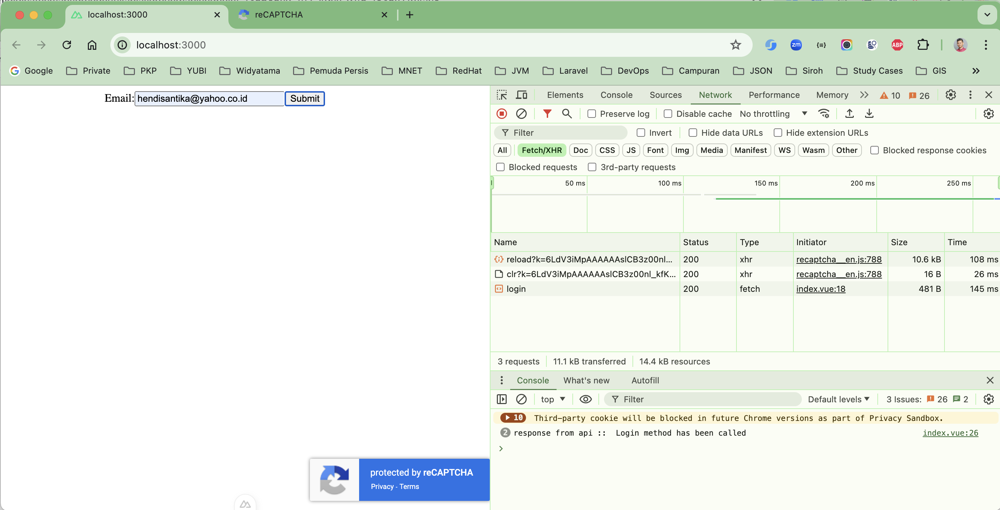

# spring-boot-capcay3-nuxtjs3

### Things todo list

1. Clone this repository: `git clone https://github.com/hendisantika/spring-boot-capcay3-nuxtjs3.git`
2. Navigate to the folder: `cd spring-boot-capcay3-nuxtjs3`
3. Create Google Recapctcha V3 [here](https://www.google.com/recaptcha/admin/create):
4. Run the application: `mvn clean spring-boot:run`
5. Go to frontend app: `cd frontend`
6. Run the command: `pnpm install`
7. Run the web app: `pnpm dev`
8. Open your favorite browser: http://localhost:3000

### Image Screenshots

Home Page





### Console Log

```shell
/Users/hendisantika/.sdkman/candidates/java/21.0.1-tem/bin/java -XX:TieredStopAtLevel=1 -Dspring.output.ansi.enabled=always -Dcom.sun.management.jmxremote -Dspring.jmx.enabled=true -Dspring.liveBeansView.mbeanDomain -Dspring.application.admin.enabled=true -Dmanagement.endpoints.jmx.exposure.include=* -javaagent:/Users/hendisantika/Applications/IntelliJ IDEA Ultimate.app/Contents/lib/idea_rt.jar=49478:/Users/hendisantika/Applications/IntelliJ IDEA Ultimate.app/Contents/bin -Dfile.encoding=UTF-8 -Dsun.stdout.encoding=UTF-8 -Dsun.stderr.encoding=UTF-8 -classpath /Users/hendisantika/IdeaProjects/spring-boot-capcay3-nuxtjs3/target/classes:/Users/hendisantika/.m2/repository/org/springframework/boot/spring-boot-starter-web/3.3.2/spring-boot-starter-web-3.3.2.jar:/Users/hendisantika/.m2/repository/org/springframework/boot/spring-boot-starter/3.3.2/spring-boot-starter-3.3.2.jar:/Users/hendisantika/.m2/repository/org/springframework/boot/spring-boot-starter-logging/3.3.2/spring-boot-starter-logging-3.3.2.jar:/Users/hendisantika/.m2/repository/ch/qos/logback/logback-classic/1.5.6/logback-classic-1.5.6.jar:/Users/hendisantika/.m2/repository/ch/qos/logback/logback-core/1.5.6/logback-core-1.5.6.jar:/Users/hendisantika/.m2/repository/org/apache/logging/log4j/log4j-to-slf4j/2.23.1/log4j-to-slf4j-2.23.1.jar:/Users/hendisantika/.m2/repository/org/apache/logging/log4j/log4j-api/2.23.1/log4j-api-2.23.1.jar:/Users/hendisantika/.m2/repository/org/slf4j/jul-to-slf4j/2.0.13/jul-to-slf4j-2.0.13.jar:/Users/hendisantika/.m2/repository/jakarta/annotation/jakarta.annotation-api/2.1.1/jakarta.annotation-api-2.1.1.jar:/Users/hendisantika/.m2/repository/org/yaml/snakeyaml/2.2/snakeyaml-2.2.jar:/Users/hendisantika/.m2/repository/org/springframework/boot/spring-boot-starter-json/3.3.2/spring-boot-starter-json-3.3.2.jar:/Users/hendisantika/.m2/repository/com/fasterxml/jackson/core/jackson-databind/2.17.2/jackson-databind-2.17.2.jar:/Users/hendisantika/.m2/repository/com/fasterxml/jackson/core/jackson-annotations/2.17.2/jackson-annotations-2.17.2.jar:/Users/hendisantika/.m2/repository/com/fasterxml/jackson/core/jackson-core/2.17.2/jackson-core-2.17.2.jar:/Users/hendisantika/.m2/repository/com/fasterxml/jackson/datatype/jackson-datatype-jdk8/2.17.2/jackson-datatype-jdk8-2.17.2.jar:/Users/hendisantika/.m2/repository/com/fasterxml/jackson/datatype/jackson-datatype-jsr310/2.17.2/jackson-datatype-jsr310-2.17.2.jar:/Users/hendisantika/.m2/repository/com/fasterxml/jackson/module/jackson-module-parameter-names/2.17.2/jackson-module-parameter-names-2.17.2.jar:/Users/hendisantika/.m2/repository/org/springframework/boot/spring-boot-starter-tomcat/3.3.2/spring-boot-starter-tomcat-3.3.2.jar:/Users/hendisantika/.m2/repository/org/apache/tomcat/embed/tomcat-embed-core/10.1.26/tomcat-embed-core-10.1.26.jar:/Users/hendisantika/.m2/repository/org/apache/tomcat/embed/tomcat-embed-el/10.1.26/tomcat-embed-el-10.1.26.jar:/Users/hendisantika/.m2/repository/org/apache/tomcat/embed/tomcat-embed-websocket/10.1.26/tomcat-embed-websocket-10.1.26.jar:/Users/hendisantika/.m2/repository/org/springframework/spring-web/6.1.11/spring-web-6.1.11.jar:/Users/hendisantika/.m2/repository/org/springframework/spring-beans/6.1.11/spring-beans-6.1.11.jar:/Users/hendisantika/.m2/repository/io/micrometer/micrometer-observation/1.13.2/micrometer-observation-1.13.2.jar:/Users/hendisantika/.m2/repository/io/micrometer/micrometer-commons/1.13.2/micrometer-commons-1.13.2.jar:/Users/hendisantika/.m2/repository/org/springframework/spring-webmvc/6.1.11/spring-webmvc-6.1.11.jar:/Users/hendisantika/.m2/repository/org/springframework/spring-context/6.1.11/spring-context-6.1.11.jar:/Users/hendisantika/.m2/repository/org/springframework/spring-expression/6.1.11/spring-expression-6.1.11.jar:/Users/hendisantika/.m2/repository/org/springframework/boot/spring-boot-starter-security/3.3.2/spring-boot-starter-security-3.3.2.jar:/Users/hendisantika/.m2/repository/org/springframework/spring-aop/6.1.11/spring-aop-6.1.11.jar:/Users/hendisantika/.m2/repository/org/springframework/security/spring-security-config/6.3.1/spring-security-config-6.3.1.jar:/Users/hendisantika/.m2/repository/org/springframework/security/spring-security-web/6.3.1/spring-security-web-6.3.1.jar:/Users/hendisantika/.m2/repository/org/springframework/boot/spring-boot-devtools/3.3.2/spring-boot-devtools-3.3.2.jar:/Users/hendisantika/.m2/repository/org/springframework/boot/spring-boot/3.3.2/spring-boot-3.3.2.jar:/Users/hendisantika/.m2/repository/org/springframework/boot/spring-boot-autoconfigure/3.3.2/spring-boot-autoconfigure-3.3.2.jar:/Users/hendisantika/.m2/repository/org/springframework/boot/spring-boot-configuration-processor/3.3.2/spring-boot-configuration-processor-3.3.2.jar:/Users/hendisantika/.m2/repository/org/projectlombok/lombok/1.18.34/lombok-1.18.34.jar:/Users/hendisantika/.m2/repository/org/slf4j/slf4j-api/2.0.13/slf4j-api-2.0.13.jar:/Users/hendisantika/.m2/repository/org/springframework/spring-core/6.1.11/spring-core-6.1.11.jar:/Users/hendisantika/.m2/repository/org/springframework/spring-jcl/6.1.11/spring-jcl-6.1.11.jar:/Users/hendisantika/.m2/repository/org/springframework/security/spring-security-core/6.3.1/spring-security-core-6.3.1.jar:/Users/hendisantika/.m2/repository/org/springframework/security/spring-security-crypto/6.3.1/spring-security-crypto-6.3.1.jar id.my.hendisantika.capcay3.SpringBootCapcay3Nuxtjs3Application

  .   ____          _            __ _ _
 /\\ / ___'_ __ _ _(_)_ __  __ _ \ \ \ \
( ( )\___ | '_ | '_| | '_ \/ _` | \ \ \ \
 \\/  ___)| |_)| | | | | || (_| |  ) ) ) )
  '  |____| .__|_| |_|_| |_\__, | / / / /
 =========|_|==============|___/=/_/_/_/

 :: Spring Boot ::                (v3.3.2)

2024-08-01T11:05:22.316+07:00  INFO 92163 --- [spring-boot-capcay3-nuxtjs3] [  restartedMain] .h.c.SpringBootCapcay3Nuxtjs3Application : Starting SpringBootCapcay3Nuxtjs3Application using Java 21.0.1 with PID 92163 (/Users/hendisantika/IdeaProjects/spring-boot-capcay3-nuxtjs3/target/classes started by hendisantika in /Users/hendisantika/IdeaProjects/spring-boot-capcay3-nuxtjs3)
2024-08-01T11:05:22.317+07:00  INFO 92163 --- [spring-boot-capcay3-nuxtjs3] [  restartedMain] .h.c.SpringBootCapcay3Nuxtjs3Application : No active profile set, falling back to 1 default profile: "default"
2024-08-01T11:05:22.333+07:00  INFO 92163 --- [spring-boot-capcay3-nuxtjs3] [  restartedMain] .e.DevToolsPropertyDefaultsPostProcessor : Devtools property defaults active! Set 'spring.devtools.add-properties' to 'false' to disable
2024-08-01T11:05:22.334+07:00  INFO 92163 --- [spring-boot-capcay3-nuxtjs3] [  restartedMain] .e.DevToolsPropertyDefaultsPostProcessor : For additional web related logging consider setting the 'logging.level.web' property to 'DEBUG'
2024-08-01T11:05:22.635+07:00  INFO 92163 --- [spring-boot-capcay3-nuxtjs3] [  restartedMain] o.s.b.w.embedded.tomcat.TomcatWebServer  : Tomcat initialized with port 8080 (http)
2024-08-01T11:05:22.643+07:00  INFO 92163 --- [spring-boot-capcay3-nuxtjs3] [  restartedMain] o.apache.catalina.core.StandardService   : Starting service [Tomcat]
2024-08-01T11:05:22.643+07:00  INFO 92163 --- [spring-boot-capcay3-nuxtjs3] [  restartedMain] o.apache.catalina.core.StandardEngine    : Starting Servlet engine: [Apache Tomcat/10.1.26]
2024-08-01T11:05:22.657+07:00  INFO 92163 --- [spring-boot-capcay3-nuxtjs3] [  restartedMain] o.a.c.c.C.[Tomcat].[localhost].[/]       : Initializing Spring embedded WebApplicationContext
2024-08-01T11:05:22.657+07:00  INFO 92163 --- [spring-boot-capcay3-nuxtjs3] [  restartedMain] w.s.c.ServletWebServerApplicationContext : Root WebApplicationContext: initialization completed in 323 ms
2024-08-01T11:05:22.724+07:00  WARN 92163 --- [spring-boot-capcay3-nuxtjs3] [  restartedMain] .s.s.UserDetailsServiceAutoConfiguration : 

Using generated security password: 55467bed-1c4c-4532-ae06-6cd5e7615061

This generated password is for development use only. Your security configuration must be updated before running your application in production.

2024-08-01T11:05:22.731+07:00  INFO 92163 --- [spring-boot-capcay3-nuxtjs3] [  restartedMain] r$InitializeUserDetailsManagerConfigurer : Global AuthenticationManager configured with UserDetailsService bean with name inMemoryUserDetailsManager
2024-08-01T11:05:22.803+07:00  INFO 92163 --- [spring-boot-capcay3-nuxtjs3] [  restartedMain] o.s.b.d.a.OptionalLiveReloadServer       : LiveReload server is running on port 35729
2024-08-01T11:05:22.813+07:00  INFO 92163 --- [spring-boot-capcay3-nuxtjs3] [  restartedMain] o.s.b.w.embedded.tomcat.TomcatWebServer  : Tomcat started on port 8080 (http) with context path '/'
2024-08-01T11:05:22.817+07:00  INFO 92163 --- [spring-boot-capcay3-nuxtjs3] [  restartedMain] .h.c.SpringBootCapcay3Nuxtjs3Application : Started SpringBootCapcay3Nuxtjs3Application in 0.639 seconds (process running for 0.939)
2024-08-01T11:05:30.187+07:00  INFO 92163 --- [spring-boot-capcay3-nuxtjs3] [nio-8080-exec-1] o.a.c.c.C.[Tomcat].[localhost].[/]       : Initializing Spring DispatcherServlet 'dispatcherServlet'
2024-08-01T11:05:30.187+07:00  INFO 92163 --- [spring-boot-capcay3-nuxtjs3] [nio-8080-exec-1] o.s.web.servlet.DispatcherServlet        : Initializing Servlet 'dispatcherServlet'
2024-08-01T11:05:30.188+07:00  INFO 92163 --- [spring-boot-capcay3-nuxtjs3] [nio-8080-exec-1] o.s.web.servlet.DispatcherServlet        : Completed initialization in 1 ms
2024-08-01T11:05:30.465+07:00  INFO 92163 --- [spring-boot-capcay3-nuxtjs3] [nio-8080-exec-2] i.m.h.c.service.GoogleRecaptchaService   : Recaptcha verification completed successfully
2024-08-01T11:05:30.465+07:00  INFO 92163 --- [spring-boot-capcay3-nuxtjs3] [nio-8080-exec-2] i.m.h.c.service.GoogleRecaptchaService   : Recaptcha response: GoogleRecaptchaResponse(success=true, challenge_ts=2024-08-01T04:02:33Z, hostname=localhost, errorCodes=null, score=0.9, action=login)
2024-08-01T11:05:33.917+07:00  INFO 92163 --- [spring-boot-capcay3-nuxtjs3] [nio-8080-exec-3] i.m.h.c.service.GoogleRecaptchaService   : Recaptcha verification completed successfully
2024-08-01T11:05:33.917+07:00  INFO 92163 --- [spring-boot-capcay3-nuxtjs3] [nio-8080-exec-3] i.m.h.c.service.GoogleRecaptchaService   : Recaptcha response: GoogleRecaptchaResponse(success=true, challenge_ts=2024-08-01T04:02:33Z, hostname=localhost, errorCodes=null, score=0.9, action=login)
2024-08-01T11:09:33.686+07:00  INFO 92163 --- [spring-boot-capcay3-nuxtjs3] [nio-8080-exec-5] i.m.h.c.service.GoogleRecaptchaService   : Recaptcha verification completed successfully
2024-08-01T11:09:33.686+07:00  INFO 92163 --- [spring-boot-capcay3-nuxtjs3] [nio-8080-exec-5] i.m.h.c.service.GoogleRecaptchaService   : Recaptcha response: GoogleRecaptchaResponse(success=true, challenge_ts=2024-08-01T04:02:33Z, hostname=localhost, errorCodes=null, score=0.9, action=login)

```
